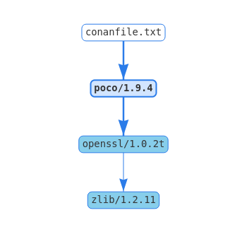

# 快速开始

以开发一个“MD5计算器”程序为例，它依赖了一个非常流行的C++的网络库[Poco](https://pocoproject.org/)来帮助它完成功能。

这个例子使用CMake作为构建工具，也可以使用别的构建工具。

这个例子的源码在github上，所以你也可以直接把代码clone下来，不用自己手动敲代码。

```sh
$ git clone https://github.com/conan-io/examples.git && cd examples/libraries/poco/md5
```

[https://github.com/conan-io/examples.git](https://github.com/conan-io/examples.git)仓库里面有conan各种用法的例子，建议clone下来系统的学习一下。

继续回到本例，按照以下步骤执行。

## 运行示例

- 首先创建一个目录，在里面创建一个`md5.cpp`文件，包含以下内容：

```cpp
// md5.cpp

#include "Poco/MD5Engine.h"
#include "Poco/DigestStream.h"

#include <iostream>


int main(int argc, char** argv)
{
    Poco::MD5Engine md5;
    Poco::DigestOutputStream ds(md5);
    ds << "abcdefghijklmnopqrstuvwxyz";
    ds.close();
    std::cout << Poco::DigestEngine::digestToHex(md5.digest()) << std::endl;
    return 0;
}
```

- 我们知道这个程序依赖Poco库，所以先让conan从ConanCenter中查找阿和库。

```sh
$ conan search poco --remote=conan-center
Existing package recipes:

poco/1.8.1
poco/1.9.3
poco/1.9.4
poco/1.10.0
poco/1.10.1
```

这里需要指定`--remote=conan-center`，否则conan将从本地cache中查找。

- 选择一个Poco的版本，可以查看它的包描述。

```sh
$ conan inspect poco/1.9.4
name: poco
version: 1.9.4
url: https://github.com/conan-io/conan-center-index
homepage: https://pocoproject.org
license: BSL-1.0
author: None
description: Modern, powerful open source C++ class libraries for building network- and internet-based applications that run on desktop, server, mobile and embedded systems.
topics: ('conan', 'poco', 'building', 'networking', 'server', 'mobile', 'embedded')
generators: cmake
exports: None
exports_sources: CMakeLists.txt
short_paths: False
apply_env: True
build_policy: None
revision_mode: hash
settings: ('os', 'arch', 'compiler', 'build_type')
options:
    cxx_14: [True, False]
    enable_apacheconnector: [True, False]
    enable_cppparser: [True, False]
    enable_crypto: [True, False]
    [...]
default_options:
    cxx_14: False
    enable_apacheconnector: False
    enable_cppparser: False
    enable_crypto: True
    [...]
```

从如上包描述中，也可以大致看出来conan的包的元信息能够描述的内容以及能力。

- 接下来，可以为md5程序指定依赖以及构建了。在目录下创建一个`conanfile.txt`文件，描述如下：

```toml
 [requires]
 poco/1.9.4

 [generators]
 cmake
```

这里构建指定的是cmake，所以需要提前预装cmake工具。在过程中将会产生一个`conanbuildinfo.cmake`文件，包含一些列CMake变量，指定了构建的include路径、库名称等，用于构建过程。

- 下一步，我们将要安装以来的包，以及为其产生用于构建的各种信息文件。

> 注意，如果你使用的GCC版本大于等于5.1，Conan为了后向兼容设置compile.libcxx为老的ABI，你需要使用下面的命令作以修改：
> ```sh
> $ conan profile new default --detect  # Generates default profile detecting > GCC and sets old ABI
> $ conan profile update settings.compiler.libcxx=libstdc++11 default  # Sets libcxx to C++11 ABI
> ```

执行以下命令安装依赖：

```sh
$ mkdir build && cd build
$ conan install ..
```

通过打印输出可以看到，Conan除了安装了直接依赖的Poco，还安装了间接依赖的OpenSSL和zlib库。同时它为我们的构建系统产生了conanbuildinfo.cmake文件。

- 现状，为MD5程序创建自己的构建文件。如下创建CmakeLists.txt文件，包含conan自动生成的conanbuildinfo.cmake文件。

```cmake
 cmake_minimum_required(VERSION 2.8.12)
 project(MD5Encrypter)

 add_definitions("-std=c++11")

 include(${CMAKE_BINARY_DIR}/conanbuildinfo.cmake)
 conan_basic_setup()

 add_executable(md5 md5.cpp)
 target_link_libraries(md5 ${CONAN_LIBS})
```

- 现在可以构建并运行最终的MD5计算器程序了。

```sh
$ cmake .. -G "Unix Makefiles" -DCMAKE_BUILD_TYPE=Release
$ cmake --build .
...
[100%] Built target md5
$ ./bin/md5
c3fcd3d76192e4007dfb496cca67e13b
```

## 依赖的安装

运行`conan install`命令，帮我们下载了依赖的Poco程序包，及其间接依赖的OpenSSL以及Zlib库。Conan自动根据我们的平台下载合适的二进制（Conan首次运行时会自动检测平台配置）。在这个过程中，conan会在当前目录下（示例中的build目录）创建conanbuildinfo.cmake文件，在该文件中能够看到各种CMake变量；还有一个conaninfo.txt文件，保存了各种配置、依赖和构建选项信息。

> 注意：
> Conan会自动根据对系统的检测结果（OS、编译器、架构等等）产生默认的profile配置。这些信息会打印在`conan install`的开始。强烈建议你review下这些选项，然后根据需要进行调整。具体调整方式可以参考[这里](https://docs.conan.io/en/latest/getting_started.html#getting-started-other-configurations)。

了解`conan install`的过程是很重要的。当命令执行时，`<userhome>/.conan/profiles/default`文件里面的配置将会被命令行程序应用。


举个例子，当命令`conan install .. --settings os="Linux" --settings compiler="gcc"`运行时，一些步骤将被执行：

- 检查对应的包的说明文件（例如 poco/1.9.4）是否已经在本地缓存中存在。如果第一次运行conan，缓存会是空的；
- 从远程的中央仓查找包的说明文件。默认从[conan-center](https://bintray.com/conan/conan-center)查找，这个可以改。
- 如果中央仓中有包的说明文件，conan客户端下载以及将其存在缓存中；
- 根据包的说明文件以及输入配置（Linux，GCC），conan在本地缓存查找与包对应的二进制；
- 如果本地缓存没有，conan在中央仓查找对应的二进制包，并下载；
- 最终，根据`[generator]`的描述，将为构建系统产生需要的文件；

Conan Server上维护了针对主流编译器和版本的二进制包，如果特定配置的二进制包不存在conan将会抛出一个错误。你可以使用`conan install .. --build=missing`来从源码构建你需要的二进制包，当然这需要你要的二进制配置被包的说明文件所支持。

## 按照自定义配置构建包

在这个例子中，我们使用conan检查的系统默认配置做的构建。

`conan install`运行前需要先定义好profile，conan会自动检测系统（编译器、体系架构等等）并将对应的profile存在`~/.conan/profiles/default`文件中。你可以根据你的需要编辑这个文件，配置新的一系列profile。

如果我们配置了一个32-bit的GCC构建类型的profile，起名为`gcc_x86`。我们可以如下运行：

```sh
conan install .. --profile=gcc_x86
```

> 提醒：强烈建议通过`conan config install`命令使用和管理[Profiles](https://docs.conan.io/en/latest/reference/profiles.html#profiles)

同样，用户可以通过`conan install`的`--setting`参数更改profile中的部分配置。例如，想要构建32位的版本，也可以使用如下命令：

```sh
conan install .. --settings arch=x86
```

上面的命令将会使用`--settings arch=x86`配置替代默认profile中的配置，然后在本地安装一个不同的二进制包。

为了能够使用32位的二进制包，你还需要调整你的本地工程构建配置：

- 对于windows，将CMake的构建改为调用`Virual Studio 14`；
- Linux上，需要在CMakeLists.txt中加入`-m32`；如 `SET(CMAKE_CXX_FLAGS "${CMAKE_CXX_FLAGS} -m32")`，包括加入到`CMAKE_C_FLAGS, CMAKE_SHARED_LINK_FLAGS and CMAKE_EXE_LINKER_FLAGS`。我们随后会展示这件事也可以用conan自动的做。
- 在macOS上，你需要定义`-DCMAKE_OSX_ARCHITECTURES=i386`

## 查看依赖

获取下来的包存在本地缓存（一般在`.conan/data`目录下），以供别的工程复用。这样在没有网络的时候依然可以清空工程继续工作。搜索本地缓存的包用该命令 `conan search "*"`。

查看一个二进制包的细节可以用`conan search poco/1.9.4@`。

包末尾的`@`符号用于指定特定的版本，否则conan会以模式搜索的方式，返回匹配“poco/1.9.4”的所有包。

可以通过`conan info <path>`命令查看当前工程的所有依赖包的细节，这个命令需要在指定工程conanfile.txt文件所在的路径。

可以使用`conan info <path> --graph=file.html`来生成依赖图，可以指定Dot或者HTML格式。



## 查找包

Conan默认配置的从[Conan Center](https://bintray.com/conan/conan-center)查找和安装包。

你可以使用如下命令在Conan Center中查找包：

```sh
$ conan search "open*" --remote=conan-center
Existing package recipes:

openal/1.18.2@bincrafters/stable
openal/1.19.0@bincrafters/stable
openal/1.19.1
opencv/2.4.13.5@conan/stable
opencv/3.4.3@conan/stable
opencv/3.4.5@conan/stable
opencv/4.0.0@conan/stable
opencv/4.0.1@conan/stable
opencv/4.1.0@conan/stable
opencv/4.1.1@conan/stable
openexr/2.3.0
openexr/2.3.0@conan/stable
openexr/2.4.0
openjpeg/2.3.0@bincrafters/stable
openjpeg/2.3.1
openjpeg/2.3.1@bincrafters/stable
openssl/1.0.2s
...
```

可以看到上面搜索出来的二进制包，有的以`@`加一个后缀结束。这个后缀`user/channel`字段，一般用于组织或个人更改了包的配置后，用于和原包做区分的（在包名和版本号之外）。