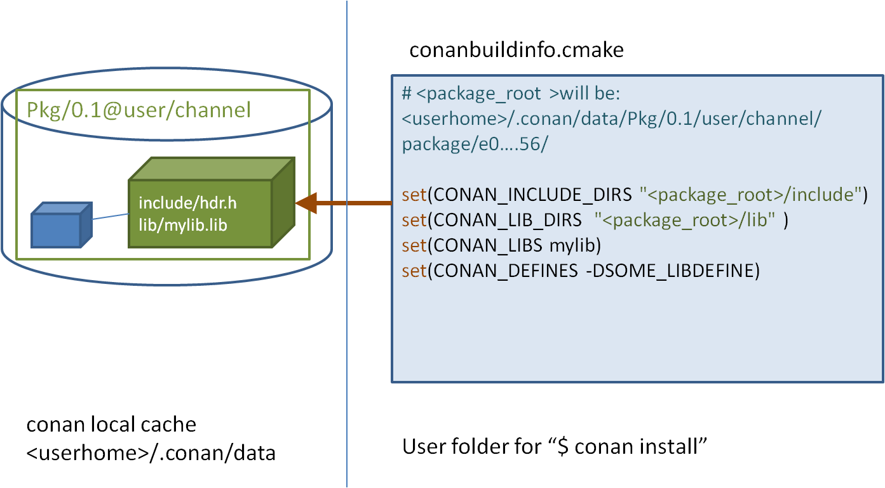

# 使用包

本节一起看看如何使用Conan建立工程以及管理依赖。

## 安装依赖

前面通过`conan install`命令下载Poco库并构建了一个案例。

在这个例子中，打开生成的`conanbuildinfo.cmake`文件，将会发现里面有很多CMake的变量声明。例如`CONAN_INCLUDE_DIRS_ZLIB`，描述了zlib库头文件的包含路径，而`CONAN_INCLUDE_DIRS`定义了所有依赖的头文件的包含路径。



如果检查这些变量定义的全路径，会发现都位于`<userhome>`目录下。这些路径构成了本地缓存，所有的包配置以及二进制文件都存储在这里，因此相同的包不会重复下载。通过`conan search`可以查看本地缓存，通过`conan remove`可以从缓存删除指定的包。

跳转到`conanbuildinfo.cmake`文件中指定的目录下，你可以找到每个包的头文件和生成的库文件。

当在命令行执行`conan install pocp/1.9.4@`的时候，Conan会将Poco包以及它的依赖包（openssl/1.0.2t and zlib/1.2.11）下载到本地缓存目录，并会在安装过程中打印出安装目录。相比一个一个的安装依赖，我们推荐使用`conanfile.txt`文件描述依赖并整体安装。下面介绍`conanfile.txt`文件的格式。

### Requires

`conanfile.txt`文件的`[requires]`段用来描述依赖，例如：

```toml
[requires]
mypackage/1.0.0@company/stable
```

在这个例子中：

- `mypackage`是依赖的包的名字；
- `1.0.0`表示包的版本。版本可以是任何的字符串，不一定非得是数字。例如可以用“develop”或“master”。另外包也可以被覆盖，所以可以使用“nightly”或者“weekly”表示它是周期产生的；
- `company`代表包的所有者。这个字段可以作为包的命名空间，允许不同的用户有同名的包。
- `stable`表示包的渠道（channel）。这个字段可以为相同的包提供一种可替换的版本，可以使用任何的字符串。例如常用的“stable”或者“testing”。也可以用于表示包为不同的目的做的修订（例如：包的版本不变，但是包的配置修改了）；

`@`符号后面的是可选的，官方将其叫做`user/chanel`描述。这是个实验特性，未来可能会变化。如果包创建和上传的时候没有指定`user`和`channel`描述，当我们指定依赖的时候就忽略`user/chanel`。如下：

```toml
[requires]
packagename/1.2.0
```

`[requires]`后面的依赖可以有多项，而且还可以覆盖依赖包的依赖。比如本例中，Conan安装了Poco以及所有它间接依赖的包（openssl/1.0.2t，zlib/1.2.11）。

现在假设OpenSSL库有新的版本发布，Conan对应有了新的包。我们不需要等着[poco项目](https://bintray.com/pocoproject/conan/Poco%3Apocoproject)更新一个使用最新OpenSSL的新的POCO包。

我们可以简单的在`[require]`下面指明新的OpenSSL版本即可：

```toml
[requires]
poco/1.9.4
openssl/1.0.2u
```

`openssl/1.0.2u`版本将会覆盖POCO中原先依赖的`openssl/1.0.2t`。

再比如，我们想要试试最新的zlib库的alpha特性，我们可以将该库替换成其它用户或者渠道（channel）的。

```toml
[requires]
poco/1.9.4
openssl/1.0.2u
zlib/1.2.11@otheruser/alpha
```

### Generators

Conan从conanfile.txt中的`[generator]`段中读取配置，然后为每个generator生成文件临时文件。这些文件一般创建在独立的“build”目录下，不需要版本控制。这些文件是按照`conan install`运行时指定的配置（Debug/Release, x86/x86_64等等）生成的，如果配置变了，这些文件响应的也会变化。

关于generator更详细的信息，可以访问官方[generator](https://docs.conan.io/en/latest/reference/generators.html#generators-reference)的文档。

### Options

我们看到在执行`conan install`的时候可以指定配置。例如`conan install .. -s build_type=Debug`。这里指定的一般都是客户机器上的项目级别的配置，一般没法在包配置中指定默认值。例如，在包配置中指定使用“Visual Studio”作为默认编译期就不合理，因为类似这些配置最好由最终用户指定，否则对于在linux工作上的用户就不友好。

但是包配置中的`[options]`最好用于指定包普遍适用的配置，以及指定默认值。例如一个包可以指定默认为静态链接，这样用户一般情况就不用再指定了。

可以使用类似`conan get poco/1.9.4@`的命令查看指定包的的options。也可以通过`conan inspect`命令，如下：

```sh
$ conan inspect poco/1.9.4@ -a=options
$ conan inspect poco/1.9.4@ -a=default_options
```

我们可以在使用中修改某个包的默认配置。例如指定poco为动态链接：

```toml
[requires]
poco/1.9.4

[generators]
cmake

[options]
poco:shared=True # PACKAGE:OPTION=VALUE
openssl:shared=True
```

下来就可以按照新的配置在build目录下构建工程了（如果不是Windows用户的修改下面命令中指定的CMake Generator）。

```sh
$ conan install ..
$ cmake .. -G "Visual Studio 14 Win64"
$ cmake --build . --config Release
```

除了在conanfile.txt中修改options，也可以直接在命令行中指定：

```sh
$ conan install .. -o poco:shared=True -o openssl:shared=True
# or even with wildcards, to apply to many packages
$ conan install .. -o *:shared=True
```

随后Conan将会安装这些包的动态库二进制文件，最终的md5计算器程序构建时将会链接这些动态库。最后，我们执行md5程序：

```sh
$ ./bin/md5
```

意外的是程序出错了，提示没有找到动态库。动态库是在运行时查找的，所以当我们运行md5程序的时候，它由于找不到动态库而出错。

我们可以通过命令查看可执行程序依赖的动态库：

```sh
$ cd bin
$ objdump -p md5
...
Dynamic Section:
 NEEDED               libPocoUtil.so.31
 NEEDED               libPocoXML.so.31
 NEEDED               libPocoJSON.so.31
 NEEDED               libPocoMongoDB.so.31
 NEEDED               libPocoNet.so.31
 NEEDED               libPocoCrypto.so.31
 NEEDED               libPocoData.so.31
 NEEDED               libPocoDataSQLite.so.31
 NEEDED               libPocoZip.so.31
 NEEDED               libPocoFoundation.so.31
 NEEDED               libpthread.so.0
 NEEDED               libdl.so.2
 NEEDED               librt.so.1
 NEEDED               libssl.so.1.0.0
 NEEDED               libcrypto.so.1.0.0
 NEEDED               libstdc++.so.6
 NEEDED               libm.so.6
 NEEDED               libgcc_s.so.1
 NEEDED               libc.so.6
```

### Imports

动态库需要加入到系统路径中才能被找到，Linux上一般在环境变量`LD_LIBRARY_PATH`中指定，OSX系统中则是`DYLD_LIBRARY_PATH`，而Windows则是加入系统`PATH`中。一般情况下将动态库拷贝到这些路径下，就可以被查找到。但是Conan尽量避免与这些不同OS的环境配置相关。

在Windows和OSX下，最简单的方式是将动态库拷贝到可执行程序所在的目录下，这样它们就可以被可执行程序找到，而不用去修改系统路径。

利用conanfile.txt的`[import]`段可以自动完成这件事。例如：

```toml
[requires]
poco/1.9.4

[generators]
cmake

[options]
poco:shared=True
openssl:shared=True

[imports]
bin, *.dll -> ./bin # Copies all dll files from packages bin folder to my "bin" folder
lib, *.dylib* -> ./bin # Copies all dylib files from packages lib folder to my "bin" folder
```

这个例子中指定将包的所有dll和dylib文件拷贝到当前工程的bin目录下。可以打开本地缓存（~/.conan/data）看看，一般包结构里面*.dll将会在"/bin"目录下，而其它的库文件则在"/lib"目录下。

增加了`import`配置后，再次在build目录下执行`conan install ..`，随后再运行程序`./bin/md5`，可以发现程序运行正常了。

查看"build/bin"目录，可以看到需要的动态库被拷贝在了这里。

官方认为`[import]`段是一个更通用的将库引入当前工程的方式。用这个方式可以把可执行程序要的其它依赖拷贝到bin目录下，例如声音、图片、为测试准备的静态文件等等。

## 使用profiles

目前我们一直使用的默认配置进行构建，配置存在`~/.conan/profiles/default`文件中。

但是，对一个大的工程，配置会越来越复杂，很难用一套配置满足所有需求。我们需要有种简单的方式在多种配制间切换。一种简单的方式是定义多个profile。

一个profile文件包含预定义好的`settings`, `options`, `environment variables` 以及`build_requires`。例如：

```toml
[settings]
setting=value

[options]
MyLib:shared=True

[env]
env_var=value

[build_requires]
Tool1/0.1@user/channel
Tool2/0.1@user/channel, Tool3/0.1@user/channel
*: Tool4/0.1@user/channel
```

Options可以指定通配符，表示将一个选项应用于许多的包。例如：

```sh
[options]
*:shared=True
```

以下是个clang_3.5的完整的例子：

```toml
[settings]
os=Macos
arch=x86_64
compiler=clang
compiler.version=3.5
compiler.libcxx=libstdc++11
build_type=Release

[env]
CC=/usr/bin/clang
CXX=/usr/bin/clang++
```

Profile文件可以存在默认的profile的目录下，或者其它工程目录下任何位置。使用profile指定的配置，可以通过命令行参数指定profile文件，例如：

```sh
$ conan create . demo/testing -pr=clang_3.5
```

继续使用Poco的例子。我们可以定义一个profile文件保存各种目标配置，然后在install的时候通过命令行参数传递给conan。

一个将依赖安装为动态库以及debug模式的profile文件(debug_shared)如下：

```toml
include(default)

[settings]
build_type=Debug

[options]
poco:shared=True
poco:enable_apacheconnector=False
openssl:shared=True
```

然后可以用下面的命令安装依赖：

```sh
$ conan install .. -pr=debug_shared
```

我们还能够创建一个profile文件（poco_clang_3.5）使用另外一个编译器版本，并将其存在工程目录下，例如：

```toml
 include(clang_3.5)

 [options]
 poco:shared=True
 poco:enable_apacheconnector=False
 openssl:shared=True
```

然后指定安装依赖使用这个新的profile：

```sh
$ conan install .. -pr=../poco_clang_3.5
```

可以给命令行传入多个profile，应用的配置将会是组合多个profile后的结果，并且根据profile文件的顺序：

```sh
$ conan install .. -pr=../poco_clang_3.5 -pr=my_build_tool1 -pr=my_build_tool2
```

[Profiles](https://docs.conan.io/en/latest/reference/profiles.html#profiles)的reference文档中有其完整的介绍，它可以为指定的库指定对应的编译器和环境变量等。还有一个命令[`conan profile`](https://docs.conan.io/en/latest/reference/commands/misc/profile.html#conan-profile)可以用来查看和管理profile。还可以使用命令[`conan config install`](https://docs.conan.io/en/latest/reference/commands/consumer/config.html#conan-config-install)命令来共享和安装profile。

## 工作流

本节总结了用户使用conan与其它工具结合安装和消费已存在的包的一般工作流程。如论是处理单配置项目，还是多配置项目，都推荐你在项目根目录中使用conanfile（.py或.txt）来配置项目。

### 单配置

当你的工程使用单一配置时，conanfile如我们前面示例中的那样，会相对比较简单。在前面的例子中，通过`conan install ..`在build目录下产生了conaninfo.txt以及conanbuildinfo.cmake文件用于支持项目构建。注意build目录是一个临时目录，不需要对其进行版本管理。

独立于源码外的build目录（Out-of-source builds）也是支持的。如下例子：

```sh
$ git clone git@github.com:conan-io/examples
$ cd libraries/poco
$ conan install ./md5 --install-folder=md5_build
```

这将产生如下的目录结构：

```
md5_build
    conaninfo.txt
    conanbuildinfo.txt
    conanbuildinfo.cmake
md5
    CMakeLists.txt  # If using cmake, but can be Makefile, sln...
    README.md
    conanfile.txt
    md5.cpp
```

现在你可以如下构建：

```sh
$ cd md5_build
$ cmake ../md5 -G "Visual Studio 15 Win64"  # or other generator
$ cmake --build . --config Release
$ ./bin/md5
> c3fcd3d76192e4007dfb496cca67e13b
```

通过上面的方式我们创建了一个和工程源码分离的build目录，这样的好处是我们可以容易的对各种配置进行试验，我们清空某一个build不会影响到别的build目录。例如我们可以增加一个Debug类型的build目录：

```sh
$ rm -rf *
$ conan install ../md5 -s build_type=Debug
$ cmake ../md5 -G "Visual Studio 15 Win64"
$ cmake --build . --config Debug
$ ./bin/md5
> c3fcd3d76192e4007dfb496cca67e13b
```

### 多配置

你可以在源码内或者源码外管理多个不同的配置，并且可以在它们之间切换而不用每次重新调用`conan install`。当然如果已经执行过`conan install`，然后在本机其它项目中使用相同的配置，再次执行`conan install`将会非常快，因为相关的包已经被安装在本地缓存中了（而不是某个项目内部）。

```sh
$ git clone git@github.com:conan-io/examples
$ cd libraries/poco
$ conan install md5 -s build_type=Debug -if md5_build_debug
$ conan install md5 -s build_type=Release -if md5_build_release

$ cd md5_build_debug && cmake ../md5 -G "Visual Studio 15 Win64" && cd ../..
$ cd md5_build_release && cmake ../md5 -G "Visual Studio 15 Win64" && cd ../..
```

注意，上面的例子中`--install-folder`被缩写为`-if`。

现在，项目目录将会如下：

```
md5_build_debug
    conaninfo.txt
    conanbuildinfo.txt
    conanbuildinfo.cmake
    CMakeCache.txt # and other cmake files
md5_build_release
    conaninfo.txt
    conanbuildinfo.txt
    conanbuildinfo.cmake
    CMakeCache.txt # and other cmake files
example-poco-timer
    CMakeLists.txt  # If using cmake, but can be Makefile, sln...
    README.md
    conanfile.txt
    md5.cpp
```

现在你可以选择到任何一个配置目录下执行构建，因为conan将具体不同的配置文件生成在不同的目录下。

```sh
$ cd md5_build_debug && cmake --build . --config Debug && cd ../..
$ cd md5_build_release && cmake --build . --config Release && cd ../..
```

注意这里需要修改例子中代码中的CMake文件的`include()`，加上cmake二进制的目录宏，否则cmake构建的时候将找不到对应的conanbuildinfo.cmake文件。

```cmake
include(${CMAKE_BINARY_DIR}/conanbuildinfo.cmake)
conan_basic_setup()
```

## 调试包

要能够调试一个包的源码，调试器需要能找到源码以及可供调试的信息（Visual Studio中的pdb文件，对于MAC和Unix系统，位于库本身中）。

一般情况下，Conan的包中没有包含调试信息文件；就算包含，每个用户的本地的缓存路径也可能不同。而且一般包都是由CI（持续集成）服务器自动构建的，供调试的信息的路径一般也和开发者机器上的不一样。

这里一个做法是在开发者的机器上直接编译一个可供调试的包，在Conan下这很简单：

```sh
conan install <reference> --build <name> --profile <debug_profile>
```

这个命令将会触发库的构建发生在开发者的机器上，因此二进制指向的源码目录就是确定的，调试器将能够根据调试信息找到源码。

